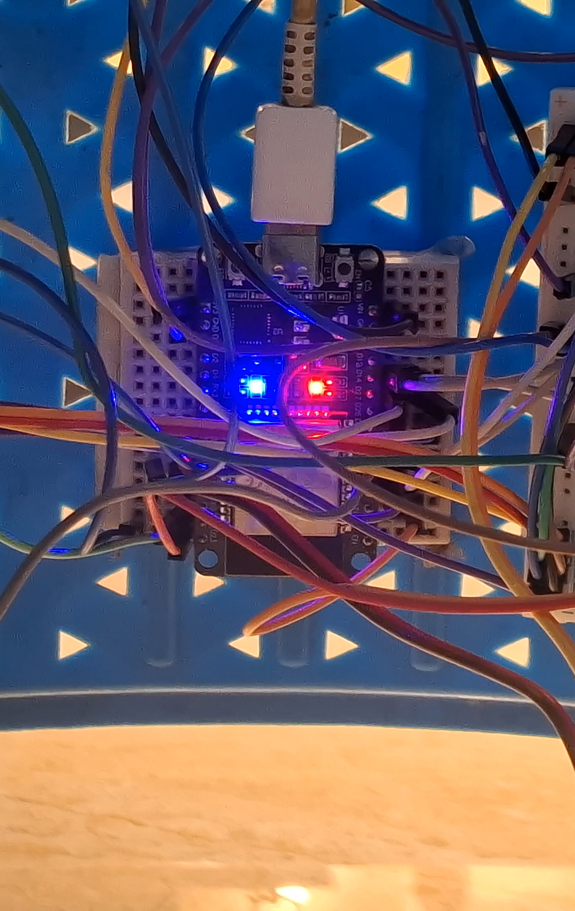
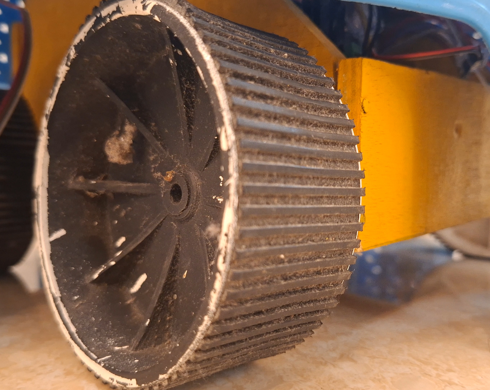
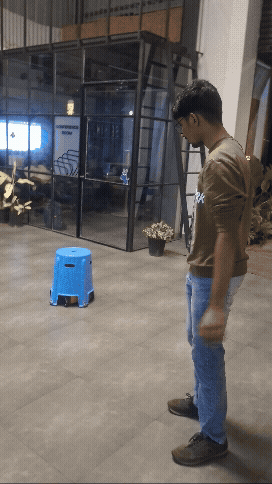

# EVade - The Autonomous Anti-Social Runaway Stool
### TinkerHub Useless Projects 3.0 • Team OnlyFlaws

**Team Members**:
- **Sam Sunny** - Muthoot Institute of Technology and Science
- **John Varghese Nettady** - Muthoot Institute of Technology and Science

An autonomous motorized runaway stool for the **ESP32 DevKit V1** that aggressively refuses to be sat on. Equipped with **360° hex-directional ultrasonic obstacle detection**, an **MPU6050 6-DOF IMU orientation & dead-reckoning system**, **discrete pulse-tap dual-relay motor steering**, an active **Self-Defense Taser Module on GPIO 4 (D4)**, **WiFi Disconnect Emergency Stop Safety**, and an embedded **Cybernetic Web Admin Portal** with wireless **ArduinoOTA** programming.

---

## Hardware Build & Component Gallery

<p align="center">
  
  <br>
  <em><b>EVade Full Hardware Prototype</b>: Autonomous runaway stool with 360-degree ultrasonic echolocation, MPU6050 IMU, dual-relay pulse-tapping engine, and GPIO 4 self-defense Taser module.</em>
</p>

| Component | Hardware Module & Subsystem | Function in EVade |
| :---: | :--- | :--- |
|  | **DOIT ESP32 DevKit V1**<br>Dual-Core Xtensa LX6 @ 240MHz | Main control unit. Core 0 hosts the cybernetic REST Web Admin & OTA server; Core 1 executes the 1000Hz real-time evasion state machine and interrupt-driven sonar triggers. |
|  | **MPU6050 6-DOF IMU**<br>I2C Fast Mode @ 400kHz | High-speed gyroscopic yaw integration and linear accelerometer tracking. Computes real-time heading, 2D dead-reckoning (X, Y) coordinates, and triggers the accelerometer stall watchdog. |
|  | **Dual-Relay & DC Motor Actuation**<br>2-Channel 5V Optocoupled Relay | Discrete pulse-tapping locomotion engine. Pulses drive relays for 60ms with 110ms resting pauses to enable measured evasion without motor vibration interfering with sonar readings. |
|  | **High-Traction Drive Tire & Wheel Assembly**<br>Direct Drive Drivetrain | Rugged high-friction rubberized drive wheels and caster balance pods allowing the stool to rapidly dash away when approached from any direction. |
|  | **HC-SR04 Ultrasonic Sonar Array**<br>Multi-Layer Trigger Network | 6-transceiver echolocation array firing synchronous 10µs pulses across GPIO 27, 14, and 23. Continuously sweeps a 360-degree perimeter to detect approaching intruders within 25–100cm. |

### Live Demonstration

<p align="center">
  
  <br>
  <em><b>EVade Live Hardware Demo (demo.gif)</b>: Autonomous runaway stool detecting an approaching intruder, calculating escape vectors, and darting away to preserve personal space.</em>
</p>

---

## Hardware Architecture

```
                                  +-----------------------+
                                  |   Raspberry Pi 4 / 5  |
                                  | (UART TX/RX Telemetry)|
                                  +-----------+-----------+
                                              | UART2 (115200)
                                              | GPIO 16 (RX) / 17 (TX)
                                              v
+------------------------+        +-----------+-----------+        +------------------------+
| 4x Ultrasonic Sensors  |        |      ESP32 DevKit     |        |   MPU6050 Gyro / IMU   |
| (Trig1: 27, Trig2: 14) +------->|        V1 (30P)       |<-------+  (I2C: GPIO 21 / 22)   |
| 4x Echos: 34, 35, 32, 25|       +-----------+-----------+        +------------------------+
+------------------------+                    |
                                              | Digital Relay Control
                                              v
                               +--------------+--------------+
                               |    2-Channel Relay Module   |
                               | (Relay 1: L / Relay 2: R)   |
                               +--------------+--------------+
                                              |
                                              v
                               [ 4x High-Torque DC Motors ]
```

> [!TIP]
> **Looking for full schematics, terminal connections, and power distribution?**
> Check out the complete [Hardware Wiring & Circuit Guide](WIRING_DIAGRAM.md).

---

## Complete ESP32 DevKit V1 Pin Mapping

### 1. 2-Channel Relay Module (Left & Right Motor Steering)
| Relay Module Pin | Function | ESP32 GPIO | Description |
| :--- | :--- | :--- | :--- |
| **IN1 (Relay 1)** | Left Motors | **GPIO 18** | Digital Output (Active LOW by default) |
| **IN2 (Relay 2)** | Right Motors | **GPIO 19** | Digital Output (Active LOW by default) |
| **VCC** | Relay Coil Power | **5V** (VIN) | 5V relay logic supply |
| **GND** | Ground | **GND** | Common ground with ESP32 & battery |

#### Relay Switching Truth Table
| Maneuver | Relay 1 (CH 1 / Left Motors) | Relay 2 (CH 2 / Right Motors) | Physical Motion |
| :--- | :--- | :--- | :--- |
| **FORWARD** | **ON** | **ON** | Both Left & Right motors ON |
| **TURN RIGHT** | **ON** | **OFF** | Left motors ON -> Robot pivots/turns Right |
| **TURN LEFT** | **OFF** | **ON** | Right motors ON -> Robot pivots/turns Left |
| **STOP / E-STOP** | **OFF** | **OFF** | Both motors cut off |

### 2. Ultrasonic Sensor Array (6 Directions: Cardinal & Rear Diagonals)
The sensors are pulsed via three synchronized trigger pins (**GPIO 27**, **GPIO 14 / D14**, and **GPIO 23 / D23** for next layer). Each sensor's echo is measured independently and non-blockingly via hardware interrupts:

| Sensor Index | Direction | Angle | ESP32 GPIO | Logic Level Note |
| :--- | :--- | :--- | :--- | :--- |
| **TRIG 1** | Primary Layer | — | **GPIO 27** | Primary 3.3V trigger output |
| **TRIG 2 (D14)**| Secondary Layer | — | **GPIO 14** | Secondary 3.3V trigger output |
| **TRIG 3 (D23)**| Next Layer | — | **GPIO 23** | Next-layer 3.3V trigger output |
| **S0** | Front | 0° | **GPIO 34** | Set 1 Cardinal (1kΩ / 2kΩ divider if 5V) |
| **S1** | Right | 90° | **GPIO 35** | Set 1 Cardinal (Divider if 5V) |
| **S2** | Back | 180° | **GPIO 32** | Set 1 Cardinal Digital Input |
| **S3** | Left | 270° | **GPIO 25** | Set 1 Cardinal Digital Input |
| **S4** | Rear-Right | 135° | **GPIO 39 (VN)**| Set 2 Rear Diagonal (Divider if 5V) |
| **S5** | Rear-Left | 225° | **GPIO 26** | Set 2 Rear Diagonal (Re-assigned from FL) |

> [!NOTE]
> - **Front-Left (FL)** and **Front-Right (FR)** sensors are disabled in firmware.
> - The sensor currently wired to the Front-Left pin (**GPIO 26**) is re-assigned as **Rear-Left (225°)**.
> - Pins **GPIO 36 (VP)** and **GPIO 33** are freed up.

> [!CAUTION]
> **Voltage Divider on 5V HC-SR04 Echo Lines:**
> The ESP32 inputs are **3.3V logic only**. If you are using standard 5V HC-SR04 sensors, step down each Echo line using a simple two-resistor voltage divider (1kΩ in series from Echo to GPIO, and 2kΩ from GPIO to GND). Alternatively, use 3.3V-native **HC-SR04P** or **RCWL-9610** modules.

### 3. MPU6050 Gyroscope / IMU
| MPU6050 Pin | ESP32 GPIO | Description |
| :--- | :--- | :--- |
| **VCC** | **3.3V** | Power supply |
| **GND** | **GND** | Common ground |
| **SDA** | **GPIO 21** | I2C Data (400 kHz Fast Mode) |
| **SCL** | **GPIO 22** | I2C Clock |

### 4. Hardware Self-Defense Taser Circuit (GPIO 4 / D4)
| Component Pin | ESP32 Pin | Signal / Function |
| :--- | :--- | :--- |
| **Taser Trigger / Relay IN** | **GPIO 4 (D4)** | Output (HIGH = Taser active when bot has no moves available) |
| **Taser Ground (-)** | **GND** | Common Ground |

---

## Software Features

### 1. Dual-Core FreeRTOS Architecture
- **Core 0 Task (`networkTask`)**:
  - Web Admin Server (REST API + Canvas UI).
  - ArduinoOTA listener (allows wireless firmware updates without plugging in USB).
- **Core 1 Task (`loop()`)**:
  - 100% non-blocking interrupt-based ultrasonic scanning.
  - High-rate MPU6050 yaw drift-compensated integration.
  - Evasion state machine & discrete pulse-tapping engine.
  - 2-Channel Relay digital motor switching.
  - Hardware Taser Defense Watchdog.

### 2. Autonomous Evasion & Taser Defense Logic
- **Adjustable Threshold Distance**: Default 25 cm (slider tunable up to 100 cm).
- **Front Blocked**: Discrete inching / tap-rotation toward the more open flank.
- **Flank Obstacle**: Rotates away from the threat direction.
- **Trapped (`STATUS_ALL_SIDES_TRAPPED`)**: When no viable moves remain (front and both rotation flanks blocked, or bot boxed in):
  - All motor relays immediately cut power.
  - **Hardware Taser Discharged**: `GPIO 4` (D4) drives HIGH to trigger the electric taser / stun module.
- **Web Admin UI Taser Control**:
  - Live warning banner: `NO MOVES AVAILABLE — BOT TRAPPED (TASER ARMED ON PIN D4) • TAP TO DISARM`.
  - Interactive Taser Button: `TEST TASER (D4)` / `DISARM TASER` for manual test discharge and safety cutoff.
  - REST API Control: `POST /api/alarm` accepts `{"state": "on"|"off"|"toggle"}` or bodyless toggle.
- Once any obstacle moves away and a path opens, the taser automatically turns OFF (`GPIO 4` goes LOW) and normal evasion resumes.

---

## Web Admin Portal (Dedicated Access Point)

Connect your phone, tablet, or laptop directly to the robot's standalone WiFi Access Point:
- **SSID**: `ESP32-EvadeBot-AP`
- **Password**: `admin12345`
- **Dashboard URL**: [http://192.168.4.1](http://192.168.4.1) (Standard ESP32 SoftAP Gateway)

- **High-Priority Emergency Stop (E-STOP)**: Prominent physical button to cut motor power and halt all motion immediately; locks controls until explicitly reset.
- **Control Mode Switcher**: Seamlessly toggle between `AUTO EVADE`, `MANUAL DRIVE`, and `PI LINK`.
- **Tactile Tank D-Pad**: Drive with zero lag using touch on phones/tablets, mouse clicks, or keyboard keys (`W, A, S, D, Space`).
- **Dynamic Config Sliders**: Rapidly tune motor drive speed (80-255) and evasion distance threshold (10-60 cm).
- **Pure Controls Layout**: Zero monitoring clutter (no radar/compass overhead), ensuring blazing-fast load times and immediate touch response.

---

## Setup & Upload

### Option A: Using PlatformIO (VS Code)
1. Clone or copy this repository into VS Code.
2. Configure your WiFi credentials in [src/config.h](file:///e:/TinkerHub/src/config.h).
3. Connect ESP32 via USB and click **Upload** or run:
   ```bash
   pio run -t upload
   ```

### Option B: Using Arduino IDE
1. Open [TinkerHub.ino](file:///e:/TinkerHub/TinkerHub.ino).
2. Install library `ArduinoJson` (v6.x) via Library Manager.
3. Select board **ESP32 Dev Module** or **DOIT ESP32 DEVKIT V1**.
4. Set CPU Frequency to **240MHz**.
5. Click **Upload**.

### Option C: Wireless Flashing (ArduinoOTA)
Once initially flashed, the ESP32 registers as `esp32-evade-bot` on your local network. You can select its network port in Arduino IDE or PlatformIO and upload code wirelessly without USB!
Password: `admin`.

---

## PC USB Serial Visualizer UI (Testing & Diagnostics)

To test, monitor, and visualize the robot's real-time actions and ultrasonic radar from your PC over the USB cable (with **zero changes** required to the ESP32 code):

1. Plug the ESP32 into your PC via USB.
2. Run the visualizer application:
   ```bash
   python tools/visualizer_ui.py
   ```
3. Select your COM port (e.g. `COM13`) and click **CONNECT**.
4. The dashboard displays:
   - **8-Direction Sonar Radar**: Real-time visual sonar beams with green/yellow/red proximity detection and distance tags.
   - **Robot Heading & Gyro Compass**: Robot chassis rotates in real time with the MPU6050 yaw.
   - **Real-Time Action Taken Banner**: Instant classification of the bot's maneuvers (e.g. `MOVING FORWARD`, `REVERSING AWAY FROM FRONT OBSTACLE`, `SPINNING LEFT`, `[E-STOP] EMERGENCY STOPPED`, `[ALERT] TRAPPED`).
   - **Motor PWM Gauges**: Dual progress bars showing Left and Right track speeds (-255 to +255).
   - **Action & Status Event Log**: Timestamped record of every obstacle trigger and state change.
   - **Raw USB Console**: Real-time stream of raw lines emitted by the ESP32.
   - **Simulation Mode**: Built-in simulator toggle to preview the visualizer offline without hardware.

---

## Team Contributions
- **Sam Sunny** (Muthoot Institute of Technology and Science): System architecture, FreeRTOS dual-core firmware development, discrete relay pulse-tapping engine, MPU6050 kinematic dead-reckoning integration, web admin portal & canvas radar development.
- **John Varghese Nettady** (Muthoot Institute of Technology and Science): Hardware stool chassis fabrication, ultrasonic sensor array mounting, high-torque motor drive & tire assembly, voltage divider wiring harness, and hardware testing.
